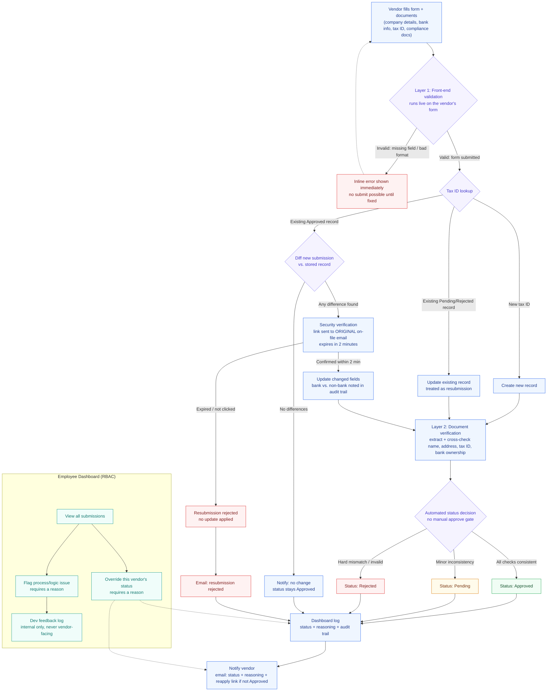

# AI-Powered Vendor Onboarding Platform

An end-to-end automated vendor onboarding system. Vendors submit company details and documents; the platform extracts, cross-checks, and decides — approved, pending, or rejected — with a full audit trail and real email notifications at every step.

[](https://dev-s-vendor-onboarding.vercel.app)
[](https://www.loom.com/share/f90d611d39aa4f21a560587a85e6d9e0)
[]()

---

## Demo

Watch the full walkthrough — happy path + all 4 edge cases — on Loom:

> **[https://www.loom.com/share/f90d611d39aa4f21a560587a85e6d9e0](https://www.loom.com/share/f90d611d39aa4f21a560587a85e6d9e0)**

Live app: **[https://dev-s-vendor-onboarding.vercel.app](https://dev-s-vendor-onboarding.vercel.app)**

---

## What it does

1. **Vendor signs up** and is taken directly to the onboarding form — company details, country-specific tax ID, bank info, and document uploads on a single page.
2. **Layer 1 (client-side)** validates everything live as the vendor types: required fields, tax ID format per country (US EIN `XX-XXXXXXX`, UK VAT `GB123456789`, India GSTIN 15-char + PAN `AAAAA9999A`), bank account format. Nothing reaches the backend until all fields are valid.
3. **Layer 2 (AI-powered)** runs on submit: Mistral OCR extracts structured data from each uploaded document and cross-checks it against the form — legal name, address, tax ID, and bank account holder — using fuzzy matching (so "Acme Inc." and "Acme Incorporated" are treated as a match, not a mismatch).
4. **Automated decision engine** produces one of three outcomes:
   - **Approved** — zero issues found
   - **Pending** — exactly one soft issue (e.g. a name formatting difference); vendor is told exactly what to fix
   - **Rejected** — tax ID hard mismatch (identity-level, not fixable by clarification), or two or more soft issues at once
5. **Real email** sent to the vendor with the decision, full reasoning, and a resubmit link if not approved.
6. **Approved vendor resubmits** → system diffs against stored record → sends a **2-minute expiring confirmation link** to the original on-file email (proves control of the trusted channel, not just the new submission). Demo both branches: confirmed in time (changes applied and re-verified), or expired (no changes made, original data stands).
7. **Employee dashboard** — see all submissions with status and reasoning, override any status (reason required, vendor is notified), or flag a logic issue to the internal dev feedback log (never visible to vendors). Full pipeline log with per-step live view.

---

## Process flow



> Static export: [`vendor_onboarding_process.svg`](vendor_onboarding_process.svg) · source: [`vendor_onboarding_process.mermaid`](vendor_onboarding_process.mermaid)

---

## Edge cases demonstrated

| # | Scenario | Outcome |
|---|----------|---------|
| EC0 | Happy path — India vendor, all documents and fields match | **Approved** |
| EC2 | Single name mismatch — bank letter says "Private Limited", form says "Pvt Ltd" | **Pending** with exact mismatch named |
| EC3 | Tax ID hard mismatch — EIN on form ≠ EIN on IRS letter | **Rejected** (hard stop, identity-level) |
| EC4 | Approved vendor resubmits with changed bank details | Security verification email, 2-min expiry — both confirm and expire branches demoed |

Exact form values and document filenames for each edge case are in [`test_docs/README.md`](test_docs/README.md).

---

## Tech stack

| Layer | Technology |
|-------|-----------|
| Frontend | React 19 + Vite + TypeScript + Tailwind CSS v4 |
| Backend | FastAPI (Python 3.11) |
| Auth / DB / Storage | Supabase (PostgreSQL + Row Level Security) |
| AI — document OCR | Mistral `mistral-ocr-latest` (free tier) |
| AI — structured extraction | Groq `openai/gpt-oss-20b` (free tier, separate rate limit) |
| Email delivery | Resend (real sends, free tier) |
| Hosting | Vercel (frontend + serverless API functions) |

All infrastructure is **free tier — $0/month.**

---

## Project structure

```
/
├── api/                          # FastAPI backend (Vercel serverless)
│   ├── app/
│   │   ├── routers/              # vendors.py, employees.py, verification.py
│   │   ├── services/             # document_extraction, cross_check, decision_engine,
│   │   │                         # decision_flow, email_service, diff, audit,
│   │   │                         # storage, fuzzy_match, verification_tokens
│   │   └── models/               # VendorSubmission, Issue, DecisionResult
│   ├── scripts/
│   │   ├── seed_employee.py      # create an employee account
│   │   └── generate_test_docs.py # generate test PDFs for all 4 edge cases
│   ├── index.py                  # Vercel serverless entrypoint
│   └── requirements.txt
├── web/                          # React frontend
│   └── src/
│       ├── pages/                # AuthPage, OnboardingPage, EmployeeDashboardPage,
│       │                         # EmployeeVendorDetailPage, ProcessLogsPage, VerifyPage
│       ├── components/ui/        # Shell, Card, Button, Field, StatusBadge, LiveRunView
│       ├── lib/                  # api.ts, supabase.ts, vendorSchema.ts, documents.ts
│       └── contexts/             # AuthContext
├── test_docs/                    # generated test PDFs (gitignored)
│   └── README.md                 # exact form values for each edge case
├── vendor_onboarding_process.mermaid   # process flow source
├── vendor_onboarding_process.svg       # process flow static export
├── vendor_onboarding_ui_mockup.html    # standalone UI mockup (open in browser)
└── vercel.json                         # full-stack deploy config
```

---

## Design artefacts

| File | Description |
|------|-------------|
| [`vendor_onboarding_process.mermaid`](vendor_onboarding_process.mermaid) | Mermaid source for the full process flowchart above |
| [`vendor_onboarding_process.svg`](vendor_onboarding_process.svg) | Static SVG export of the process flow |
| [`vendor_onboarding_ui_mockup.html`](vendor_onboarding_ui_mockup.html) | Standalone HTML mockup — open directly in a browser to see the sign-in/sign-up card and onboarding form with live validation error states |

---

## Running locally

### Prerequisites

- Python 3.11+
- Node.js 18+
- A [Supabase](https://supabase.com) project (free tier)
- A [Mistral](https://console.mistral.ai) API key (free tier)
- A [Groq](https://console.groq.com) API key (free tier)
- A [Resend](https://resend.com) API key (free tier)

### Backend

```bash
cd api
python -m venv venv
venv\Scripts\activate          # Windows
# source venv/bin/activate     # Mac/Linux
pip install -r requirements.txt

cp .env.example .env           # fill in secrets (see below)
uvicorn app.main:app --reload
```

### Frontend

```bash
cd web
npm install
cp .env.example .env.local     # fill in Supabase URL + anon key + API URL
npm run dev
```

### Create an employee account

```bash
cd api
PYTHONPATH=. python scripts/seed_employee.py employee@example.com YourPassword123!
```

### Generate test documents

```bash
cd api
PYTHONPATH=. python scripts/generate_test_docs.py
# outputs to test_docs/ — see test_docs/README.md for exact form values per edge case
```

---

## Environment variables

### Backend (`api/.env`)

```env
SUPABASE_URL=
SUPABASE_SERVICE_ROLE_KEY=
MISTRAL_API_KEY=
GROQ_API_KEY=
RESEND_API_KEY=
RESEND_FROM_EMAIL=onboarding@resend.dev
RESEND_TO_OVERRIDE=          # optional: redirect all emails to one address (useful for testing)
FRONTEND_URL=http://localhost:5173
```

### Frontend (`web/.env.local`)

```env
VITE_SUPABASE_URL=
VITE_SUPABASE_ANON_KEY=
VITE_API_URL=http://localhost:8000
```

---

## Database schema

Five tables in Supabase with Row Level Security enabled:

| Table | Purpose |
|-------|---------|
| `profiles` | Every auth user (vendor or employee) with `role` |
| `vendors` | One row per vendor — all form fields, status, `latest_reasoning` |
| `audit_log` | Every automated decision and employee override with full context |
| `verification_tokens` | 2-minute expiring links for approved-vendor resubmissions |
| `dev_feedback` | Internal employee flags on process/logic issues (never vendor-facing) |

RLS policies: vendors see only their own row; employees see everything. Writes to `audit_log`, `verification_tokens`, and `dev_feedback` are service-role only (backend-side, bypasses RLS by design).

---

## Deploying to Vercel

1. Push to GitHub, import the repo in Vercel.
2. Set these environment variables in the Vercel project dashboard:

```
SUPABASE_URL
SUPABASE_SERVICE_ROLE_KEY
MISTRAL_API_KEY
GROQ_API_KEY
RESEND_API_KEY
RESEND_FROM_EMAIL
FRONTEND_URL     ← your https://your-app.vercel.app URL
```

The frontend env vars (`VITE_*`) are in `web/.env.production` and baked in at build time.

---

## Author

**Sanskar Bajaj** — [GitHub](https://github.com/SanskarBajaj123)
